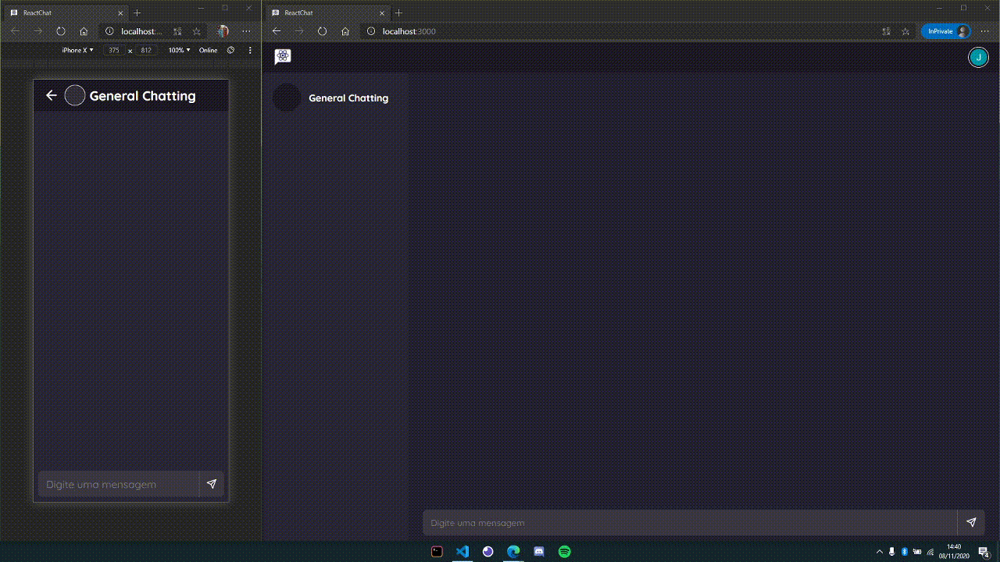

<i><h1 align='center'>ReactChat</h1></i>
<p align='center'>A ReactJS real-time chatting application with Firebase and Styled Components</p>

<p align='center'>
  
</p>

## 📌 Index
- [About](#about)
- [What's inside the box](#whats-inside-the-box)
- [How to play](#how-to-play)
- [To implement](#to-implement)
- [How you can contribute](#how-you-can-contribute)

---

## ✨ Preview
- *Netlify App Soon...*

## ❓ About
- A web application that simulates a real-time chat app.
- The app was made for study purposes and have this requirements:
  1. A solid interface with **UX pratices** applied;
  2. Use que **Firebase Firestore** for the messaging;
  3. Make a **Login with Google and Facebook** (use Firebase to this)

## 📦 What's inside the box?
- [ReactJS](https://pt-br.reactjs.org/) with [Typescript](https://www.typescriptlang.org/)
- [Styled Components](https://styled-components.com/)
- [React Icons](https://react-icons.github.io/react-icons/)
- [Firebase Console](https://console.firebase.google.com)

## 👩‍💻 How to play
- Clone the repo with
```
$ git clone https://github.com/joaopaulo-ld/simples-conta-internet-banking
```
- Install the dependecies with `yarn` or `npm i`
- Run the project with `yarn start` or `npm start`
- Start hacking on `localhost:3000`

## 👀 To implement
- [ ] Do all the requirements
- [ ] Responsive UI
- [ ] Make a user able to have multiple contacts on his app, and message in realtime with other users
- [ ] Make chat groups
- [ ] Make message status with icons (like WhatsApp and Telegram)

## 💪 How you can contribute
- Leave a ⭐ on this repo

- Fork and make a new `git branch` for the updates

- Make a PR to include all your new features!

<h3 align='center'>💥 Thanks for the attention, let's code 🔥</h3>
